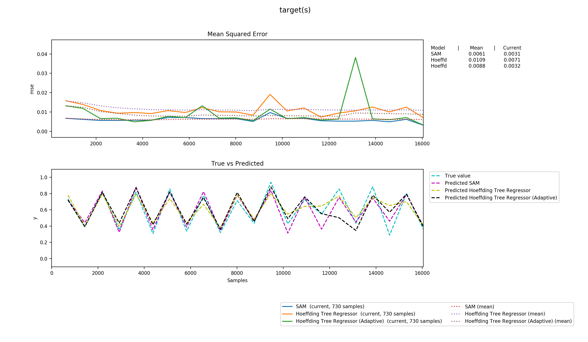

# SAM-kNN Regressor
*Based on Self Adapting Memory (SAM) kNN classifier developed at University of Bielefeld (Paper[^paper])*

-----
## Rationale 

Starting with a drift adapting classifier algorithm, we were looking for a way to turn this findings into a method for regression on streaming data.

The architecture of such SAM-kNN is already described in the paper but breaks down into the following:

- Instead of one (transient) storage three kinds of storage  are assessed using a distance weighted kNN to calculate a prediction. 
  - The Short Term Memory (STM) is used to model the most recent concept
  - The Long Term Memory (LTM) holds information about general and past concepts
  - A combination of both is used to properly exploit both Memories for prediction gains
  

To help with adapting the STM of size *n* its performance is assessed on the *n/2, *n/4, n/8, ..., 50* latest elements. If a smaller set yields better results than the full one the older part gets discarded.

Instead of just dropping these items, those that still comply with the STM are moved into the LTM.

To keep the LTM of size *m* at a reasonable size a kmeans++ clustering is conducted on it using *m/2* clusters

> More detailed steps can be found in the linked paper[^paper]

### Adjustments

To make use of this concept in a regressor we had to make some adjustments.

First we had to find a way to track the accummulated error of each memory. While in the classifier this is quite easy, we needed to accommodate to the continual nature in a regressor. We found that using *summed logistic error* is a good fit thatdoes not allow outliers hijack the overall error.

Cleaning discarded items was another issue. We had to find another way to tell if elements comply with the STM.
We look at the next *k* neighbours of each element *e* in the (cleaned) STM. We use these to determine a maximum distance.
The difference of each item is weighted using an inverse exponential function of their distance. We use these to find a normalized maximum difference.
In our discarded set we query all items around the point of *e*, normalize their difference and finally drop each which has a normalized difference greater than the previously determined max_difference (For every point of the STM). This one is actually discussable as we could also drop items as soon as they are not in range of at least one items of the STM.

The same technique is applied to clean the LTM instead of the kmeans++ in the original one.

To form a prediction inverse distance weighting[^idw] is used.


### Examples

- `./dataset.py`
  A testsuite from the `scikit-multiflow` project. Uses 10 years of weather data[^weather] (2006 - 2016, Humidity, Wind, Temperature, Air Pressure,...). It tries to find the real temperature given the average humidity, air pressure and wind speed. Our tests showed that using our algorithm results in marginally smaller summed squared errors than the Hoeffding Tree implementations that come with scikit-multiflow.
  
  Noticably, SAM-kNN has almost always smaller spikes than its contenders.
- `./stairs.py`
  A simulated test that does three sweeps over the range [0..1]. Each time the lower half is constructed using ste same linear function (and some gaussian noise). The second half is computed using a random slope.
  
  
  
  
  ```
  ADAPTING: old size & error:  566 0.031908149280463025 new size & error:  70 0.02675182593747353
  Added 331 of 496 to LTM. 
  ADAPTING: old size & error:  309 0.010498344707585998 new size & error:  154 0.010302496652124097
  Added 151 of 155 to LTM. 
  ADAPTING: old size & error:  402 0.015025775010344506 new size & error:  50 0.014857742991631865
  Added 173 of 352 to LTM. 
  LTM size: 357 STM size: 497
  Errors:  STM:  3.1072852475465735   LTM:  100.69982470840895   COMB:  36.423858618567415
  ```
  It's clearly visible here how the algorithm works. The first adaption takes place when the second random slope (new concept) becomes present enough to justify dropping 496 elements from STM. It also shows the effect of some data in the STM that act like an anchor for some of the dropped data in the upper right.
  Likewise the second figure shows the second concept beeing fully adapted to. Also the LTM got cleaned intermediately as well.
  Finally the third shows the introduction of a third concept.
  The fourth figure shows the distribution of all points other the whole input as well as the final state of LTM and STM. It proves that the model successfully kept the stable concept of the lower half in the LTM. Also the STM is perfectly adapted to the third concept on the upper half.
  Its still debatable if the LTM should still hold at least the previous concept in part.

-----

## Setup

Installation with pip:

``` sh
$ pip install git+https://github.com/ysndr/sam-knn-regressor.git
```

Development using nix[^nix]
```
$ nix-shell

or use pinned version

$ nix-shell --arg pinned './.nixpkgs-version.json'
```
this will drop you into a shell with all needed dependencies installed.

Download weather data if needed from https://www.kaggle.com/budincsevity/szeged-weather or  https://github.com/ssarkar445/Weather-in-Szeged-2006-20

[^paper]: https://www.techfak.uni-bielefeld.de/~hwersing/LosingHammerWersing_KIS_2018.pdf
[^idw]: https://en.wikipedia.org/wiki/Inverse_distance_weighting
[^weather]: https://www.kaggle.com/budincsevity/szeged-weather
[^weather-repo]: https://github.com/ssarkar445/Weather-in-Szeged-2006-2016
[^nix]: https://nixos.org/nix/
